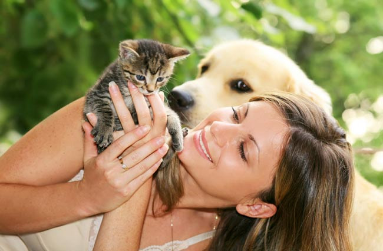
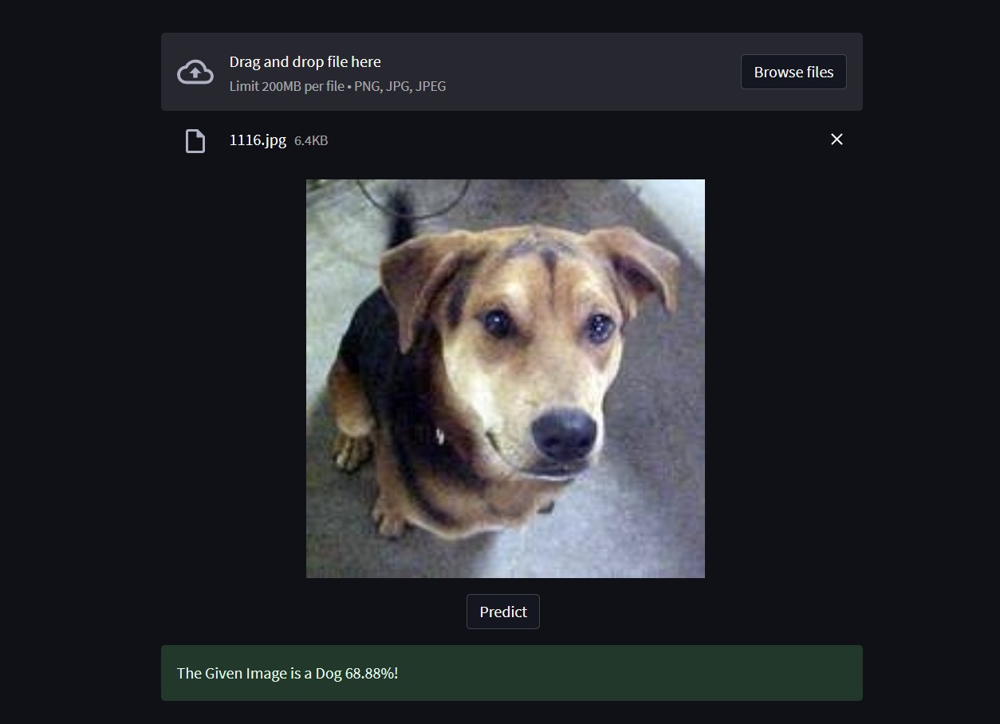

# Person 🧑🏻‍🦱 - Dog 🐶 - Cat 🐈 Model



## Multi Classification Person-Dog-Cat Model with Transfer Learning

The Model predicts if a given image is a Dog, Cat or a Person.

It was trained using Transfer Learning, with the VGG-16 Model. The last output layer was removed and then updated with a output layer of three neurons, with a `softmax` activation function. 

The Model was retrained with 1000 images from each class.

## Check-it out
Test the Model by yourself running the `main.py` file, built with `Streamlit`.

Remember first to run the model `jupyter notebook` file and save it.



## Run
```sh
streamlit run app.py
```

## Resources
- Dog-Cat Dataset: https://www.kaggle.com/datasets/shaunthesheep/microsoft-catsvsdogs-dataset

- Human Faces Dataset: https://www.kaggle.com/datasets/ashwingupta3012/human-faces

